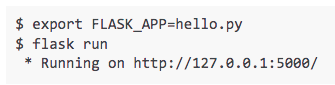
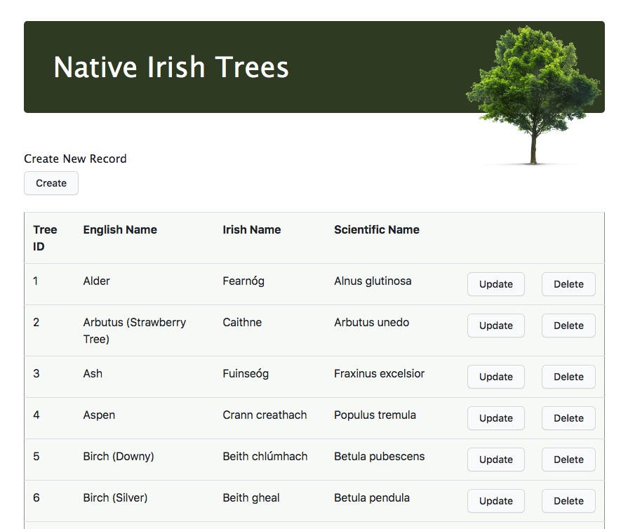

# data-representation-project
This repo contains the work submitted as part of the assessment for the Data Representation module as part of the HDip in Data Analytics, GMIT. 

## Web application for performing CRUD operations on SQL database:

- HTML/CSS frontend 
- Sends AJAX requests (JavaScript) to ...  
- RESTful API (Python script) via Flask server  
- Data Access Object (Python script) interfaces mySQL Database
- Hosted on PythonAnywhere  

## How to run the app on your machine

- Clone this repository [Instructions here](https://docs.github.com/en/repositories/creating-and-managing-repositories/cloning-a-repository)
- Install Anaconda and mySQL on your machine
- Go to the command prompt and navigate to the repository
- Initiate mysql and create the database by typing: mysql -u [your username] -p [your password] [database name] < initDB.sql
- To run on local host [Full instructions here](https://flask.palletsprojects.com/en/1.1.x/quickstart/): 

## Hosted on Pythonanywhere

- The app is hosted online at [http://izzymcizzface.pythonanywhere.com/](http://izzymcizzface.pythonanywhere.com/)
- Credentials for login
&nbsp;&nbsp;&nbsp;&nbsp;&nbsp;&nbsp;&nbsp;&nbsp;Username: Andrew 
&nbsp;&nbsp;&nbsp;&nbsp;&nbsp;&nbsp;&nbsp;&nbsp;Password: password

 

- From the profile page, you can navigate to the tree database 

